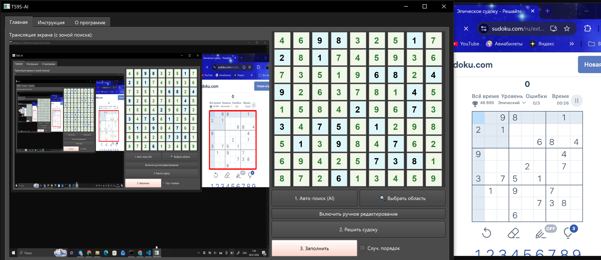

# 🧩 TS9S-AI: Hybrid Sudoku Solver


**TS9S-AI** — это продвинутое десктопное приложение для автоматического решения судоку в реальном времени. Проект объединяет компьютерное зрение (Computer Vision) для распознавания поля на экране и высокопроизводительный C++ алгоритм для мгновенного поиска решения.

> **📥 Скачать готовую версию (Windows):**
>
> Перейдите в раздел **[Releases](https://github.com/ВАШ-НИК/TS9S-AI/releases/latest)** и скачайте последний ZIP-архив.
> *(Не требует установки Python и настройки окружения).*

---

## 📸 Демонстрация




---

## ✨ Ключевые возможности

*   **🔍 Умный поиск (Auto-Detect):** Использует **YOLOv8** для автоматического нахождения сетки судоку на экране монитора, независимо от размера окна браузера или темы оформления.
*   **✂️ Ручное выделение (Snipping Tool):** Если автоматика не справилась, можно вручную выделить область экрана с помощью встроенного инструмента "ножницы".
*   **👁️ Распознавание (OCR):** Собственная модель на базе **ResNet-18**, обученная на тысячах примеров компьютерных шрифтов судоку.
*   **⚡ Мгновенное решение:** Ядро решателя написано на **C++**. Алгоритм обратного отслеживания (Backtracking) с эвристикой MRV находит решение за микросекунды.
*   **🖱️ Эмуляция человека (Anti-Cheat):**
    *   Ввод решения с помощью виртуальной клавиатуры и мыши.
    *   Режим "Случайный порядок" заполняет клетки хаотично, имитируя поведение реального игрока и обходя простые анти-бот системы.
*   **🎨 Визуальная обратная связь:** Красная рамка в реальном времени показывает зону, которую "видит" программа.

---

## 🛠️ Технологический стек

*   **Языки:** Python 3 (Logic & UI), C++17 (Core Algo).
*   **GUI:** PyQt6 (с поддержкой High DPI и многопоточности).
*   **Computer Vision:** PyTorch, Torchvision, Ultralytics YOLOv8, Pillow.
*   **Automation:** Mouse & Keyboard libraries.

---

## 📂 Структура проекта

```text
TS9S-AI/
├── assets/                 # Скриншоты и медиа
├── models/                 # Веса нейросетей
│   ├── yolo.pt             # Детектор поля
│   └── ocr.pth             # Распознавание цифр
├── solver/                 # C++ решатель
│   ├── sudoku.cpp          # Исходный код алгоритма
│   ├── a.exe               # Бинарник (Windows)
│   └── a.out               # Бинарник (Linux)
├── src/                    # Исходный код Python
│   ├── main.py             # Точка входа (GUI)
│   └── sudoku_core.py      # Бэкенд логика (ML + Wrapper)
├── requirements.txt        # Зависимости Python
└── README.md               # Документация
```

---

## 🚀 Запуск из исходного кода

Если вы разработчик и хотите запустить проект через интерпретатор Python:

### 1. Клонирование репозитория
```bash
git clone https://github.com/aRTIKa-afk/The-sudoku-9x9-solver-TS9S.git
cd The-sudoku-9x9-solver-TS9S
```

### 2. Настройка окружения
Рекомендуется использовать виртуальное окружение:
```bash
# Windows
python -m venv venv
venv\Scripts\activate

# Linux / MacOS
python3 -m venv venv
source venv/bin/activate
```

### 3. Установка зависимостей
```bash
pip install -r requirements.txt
```

### 4. Компиляция C++ решателя (Опционально)
В репозитории уже лежат скомпилированные файлы, но вы можете пересобрать их:

**Windows (MinGW/G++):**
```bash
cd solver
g++ -O2 -std=c++17 sudoku.cpp -o a.exe
cd ..
```

**Linux:**
```bash
cd solver
g++ -O2 -std=c++17 sudoku.cpp -o a.out
cd ..
```

### 5. Запуск
```bash
python src/main.py
```

---

## 📖 Инструкция по использованию

1.  **Подготовка:** Откройте сайт с судоку (лучше всего работает с sudoku.com) в браузере. Убедитесь, что все поле видно.
2.  **Поиск:**
    *   Нажмите **"1. Авто-поиск (AI)"**.
    *   *Или* нажмите **"🔍 Выбрать область"** и выделите прямоугольник вручную.
    *   Убедитесь, что вокруг поля появилась **красная рамка** на превью в программе.
3.  **Проверка:** Взгляните на цифры в сетке программы. Если OCR ошибся, нажмите **"Включить ручное редактирование"** и исправьте ячейки.
4.  **Решение:** Нажмите **"2. Решить судоку"**. Программа заполнит пустые клетки зелеными цифрами.
5.  **Ввод:**
    *   Поставьте галочку **"Случ. порядок"** (рекомендуется).
    *   Нажмите **"3. Заполнить"**.
    *   **⚠️ Внимание:** Как только исчезнет таймер (5 секунд), уберите руки от мыши и клавиатуры! Программа перехватит управление для ввода цифр.

---

## 🧠 Как это работает

1.  **Screen Capture:** `ImageGrab` делает снимок экрана.
2.  **Detection:** YOLOv8 находит координаты bounding box `(x1, y1, x2, y2)`.
3.  **Preprocessing:** Изображение кропается и нарезается на 81 фрагмент (9x9).
4.  **Inference:** Каждый фрагмент проходит через ResNet-18 для классификации (цифра 1-9 или пусто).
5.  **Solving:**
    *   Сетка преобразуется в строковый формат.
    *   Вызывается `subprocess` с C++ бинарником.
    *   C++ использует рекурсивный поиск с возвратом (Backtracking) и оптимизацией MRV.
6.  **Automation:** Python читает решение и эмулирует аппаратные нажатия клавиш.

---

## 🤝 Контакты

**[Ivanov Artem / aRTIKa-afk]**
*   GitHub: [github.com/aRTIKa-afk](https://github.com/aRTIKa-afk)
*   Email: [artiiv240606@mail.ru](mailto:artiiv240606@mail.ru)

---
## *Проект создан в образовательных целях.*
